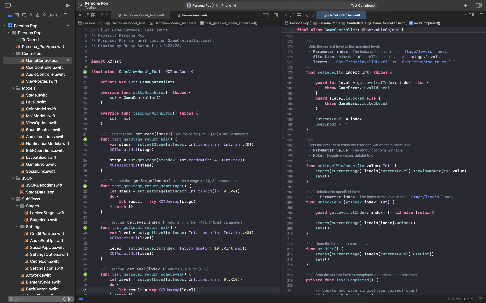

&copy; [Reese Barnett](https://www.linkedin.com/in/reesebarnett2024)

# [Persona Pop](https://apps.apple.com/us/app/persona-pop/id1638032169) (Native iOS Mobile Application)

**Notice:** Due to copyright and security concerns, this directory is not a complete representation of the app _Persona Pop_ found in the iOS App Store.

---

## Welcome to [Persona Pop](https://apps.apple.com/us/app/persona-pop/id1638032169)!

  

Welcome to [Persona Pop](https://apps.apple.com/us/app/persona-pop/id1638032169)! Have fun taking a pop quiz on popular television shows and movie personas. How well can you identify television shows and movies based on vague representations of popular characters? This project was started in Barnett's free time as a way to have fun programming.

---

## Agile Development Methodology

[Persona Pop](https://apps.apple.com/us/app/persona-pop/id1638032169) is developed and maintained by a single developer, [Reese Barnett](https://www.linkedin.com/in/reesebarnett2024). Barnett is responsible for the _**UI/UX design**_, _**front-end code**_, and _**back-end code**_. This project uses an iterative development process called _**Agile**_ that allows Barnett to evolve requirements and solutions over the lifetime of the application.

- Developer: [Reese Barnett](https://www.linkedin.com/in/reesebarnett2024) (Full-Stack)
- Programming Technologies: Xcode, SwiftUI, iOS SDK, Swift Package Manager, Git
- Design Technologies: Adobe XD, Adobe Illustrator, Adobe Photoshop, Lottie, Icons8
- Frameworks: XCTest, Lottie, AVFAudio, Message UI, UserNotification, Accessibility
- Language: Swift

---

## Design Process

###### Tools: Adobe XD, Adobe Illustrator, Adobe Photoshop, Lottie, Icons8

#### Product Research & Definition

- Barnett conducted _**user research**_ and _**market research**_. This allowed him to discover and better understand various design choices to implement into [Persona Pop](https://apps.apple.com/us/app/persona-pop/id1638032169). One way he conducted research is through Apple's own [Human Interface Guidelines](https://developer.apple.com/design/human-interface-guidelines/guidelines/overview/) and [App Store Review Guidelines](https://developer.apple.com/app-store/review/guidelines/). Barnett developed a better understanding of what makes apps engaging, useful, and safe. Using the research, he was able to successfully define the functional requirements, target audience, and app specifications. This phase resulted in a _**high-level outline**_ of the application and its purpose.

#### Design & Prototype

- With the users' expectations well-defined, Barnett was able to design and prototype the application. This phase included _**wireframes**_, _**mockups**_, and _**prototyping**_. Wireframing allowed Barnett to visualize the basic structure of the application. Mockups (implemented using _**Adobe Xd**_) allowed Barnett to visualize the structure along with the ornamental design of the application. Finally, prototyping allowed Barnett to better understand the _**view hierarchy**_ and _**navigation**_ between the views.

---

## Frontend Development

###### Tools: iOS SDK, Swift Package Manager, Xcode, Git

###### Frameworks: SwiftUI, UIKit, MessageUI, UserNotification

#### Model-View-ViewModel Architecture

- In accordance with the _**MVVM**_ architecture, all _**views**_ in [Persona Pop](https://apps.apple.com/us/app/persona-pop/id1638032169) simply present data. Because views are what the _**end-users**_ interact with, a view can contain functionality for user interactions, visual behaviors, and communication with the _**view model**_. Even with that functionality, a view can **never** directly modify data. Communication between the view model and view is accomplished by using the `@EnvironmentObject` property wrapper when declaring the view model in the view. The `@EnvironmnetObject` property wrapper tells the view to watch the view model for any state changes.

#### Views & Sub-Views

- A view in [Persona Pop](https://apps.apple.com/us/app/persona-pop/id1638032169) is a complex composition of smaller views called _**sub-views**_. A sub-view is a custom view defined in a separate structure (and often a separate file) from the view it is a component of. For example, the view defined in [LevelGrid.swift](Frontend/MainViews/LevelGrid.swift) is composed of sub-views defined in [LevelIcon.swift](Frontend/SubViews/LevelIcon.swift) and [UnlockLevelPopUp.swift](Frontend/SubViews/UnlockLevelPopUp.swift). In _**Swift**_, a view is simply a structure that conforms to the `View` protocol. This protocol provides modifiers that Barnett uses to configure the views.

---

## Backend Development

###### Tools: Swift, iOS SDK, Xcode, Git

###### Frameworks: AVFAudio, Accessibility, UIKit

#### Model-View-ViewModel Architecture

- In accordance with the _**MVVM**_ architecture, the backend code is split between _**models**_ and _**view models**_. Models are [Persona Pop](https://apps.apple.com/us/app/persona-pop/id1638032169)'s _**domain model**_ as well as validation logic. View models _**encapsulate**_ a model by only exposing relevant data to the views. When state changes occur in the Model, the view model notifies the relevant views to update.

#### Models & ViewModels

- The communication between the view models and views is accomplished with the `ObservableObject` protocol. The `ObservableObject` protocol allows specific properties to be marked with the `@Published` property wrapper so that changes to the property notify relevant views to update. The view models communicate with the models by calling the model's methods. For example, the view model defined in [CoinController.swift](Backend/ViewModels/CoinController.swift) encapsulates the model defined in [CoinModel.swift](Backend/Models/CoinModel.swift), and communicates with the view defined in [Artwork.swift](Frontend/SubViews/Artwork.swift).

---

## Data Management

###### Tools: JSON, File Processing, JSON Validator, Swift, iOS SDK, Xcode, Git

###### Frameworks: Foundation (JSONDecoder, JSONEncoder)

#### Database Management System vs File Processing

- One challenge Barnett faced is deciding where to store the _**user's data**_. Using a _**DBMS**_ comes with many useful predefined features but can also add a lot of overhead if the features provided are unnecessary for the application. _**File processing**_ reduces the overhead, but many features will have to be developed by hand. Since [Persona Pop](https://apps.apple.com/us/app/persona-pop/id1638032169) does not collect large amounts of user data, only requires single-user access, and requires minimal scaling in the future, file processing is used to store data.

#### JSON Data Storage

- Data in [Persona Pop](https://apps.apple.com/us/app/persona-pop/id1638032169) is stored on the device using _**JSON**_. When a user makes a change to the application's data, the corresponding model instance is _**encoded**_ as JSON. This JSON file overwrites the preexisting JSON file of the same name. When the user opens the app, the previously saved JSON is _**decoded**_ back into the model instance, allowing the user to resume where they left off.

---

## Unit Testing

###### Tools: Swift, iOS SDK, Xcode, Git

###### Frameworks: XCTest

#### Unit Testing

- Barnett implemented _**unit tests**_ with the _**XCTest**_ framework. This framework seamlessly integrates with _**Xcode**_'s testing workflow. Unit tests allow Barnett to test methods and functions across his project for the proper output. Using `XCTAssert...(...)` functions Barnett was able to test his back-end code. This ensured that [Persona Pop](https://apps.apple.com/us/app/persona-pop/id1638032169) will be ready for production and a wide variety of inputs.
