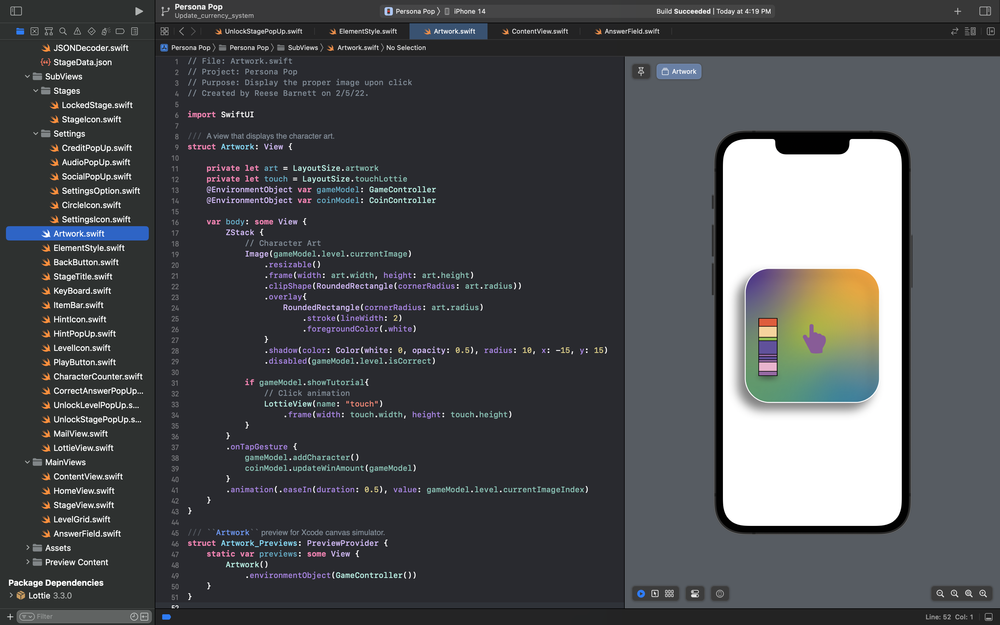
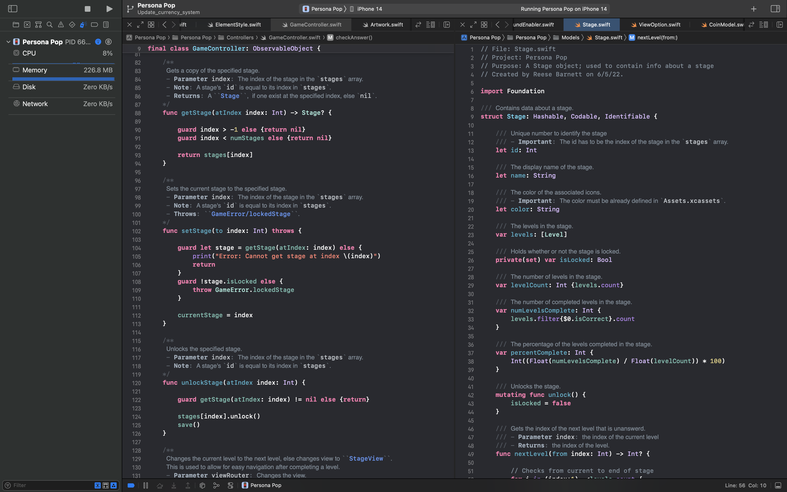
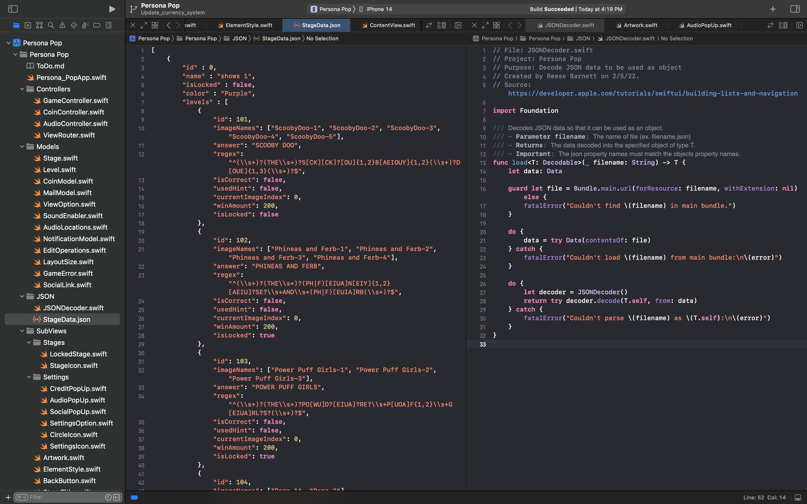

&copy; Reese Barnett

# Persona Pop (Native iOS Mobile Application)

**Notice:** Due to copyright and security concerns this directory is not a complete representation of the app _Persona Pop_ found in the iOS App Store.

---

## Welcome to [Persona Pop](https://apps.apple.com/us/app/persona-pop/id1638032169)!

  

Welcome to [Persona Pop](https://apps.apple.com/us/app/persona-pop/id1638032169)! Have fun taking a pop quiz on popular television shows and movie personas. How well can you identify television shows and movies based on vague representations of popular characters? This project was started in Barnett's free time as a way to have fun programming.

---

## Agile Development Methodology

[Persona Pop](https://apps.apple.com/us/app/persona-pop/id1638032169) is developed and maintained by a single developer, [Reese Barnett](www.linkedin.com/in/reesebarnett2024). Barnett is responsible for the _**UI/UX design**_, _**frontend code**_, and _**backend code**_. This project uses an iterative development process called _**Agile**_ that allows Barnett to evolve requirements and solutions over the lifetime of the application.

- Developer(s): [Reese Barnett](www.linkedin.com/in/reesebarnett2024) (Full-Stack)
- Programming Technologie(s): Xcode, SwiftUI, iOS SDK, Swift Package Manager, Git
- Design Technologies(s): Adobe XD, Adobe Illustrator, Adobe Photoshop, Lottie, Icons8
- Framework(s): AVFAudio, Message UI, UserNotification, Accessibility
- Language(s): Swift

---

## Design Process

###### Tools: Adobe XD, Adobe Illustrator, Adobe Photoshop, Lottie, Icons8

#### Product Research & Definition

- Barnett conducted _**user research**_ and _**market research**_. This allowed him to discover and better understand various design choices to implement into [Persona Pop](https://apps.apple.com/us/app/persona-pop/id1638032169). One way he conducted research is through deep analysis. He would spend time at length with similar apps, assigning each a grade based on well-defined criteria. Barnett developed a better understanding of what makes apps engaging and useful. Using the research he was able to successfully define the functional requirements, target audience, and app specifications. This phase resulted in a _**high-level outline**_ of the application and its purpose.

#### Design & Prototype

- With the users expectations well-defined, Barnett was able to design and prototype the application. This phase included _**wireframes**_, _**mockups**_, and _**prototyping**_. Wire framing allowed Barnett to visualize the basic structure of the application. Mockups (implemented using _**Adobe Xd**_) allowed Barnett to visualize the structure along with the ornamental design of the application. Finally, prototyping allowed Barnett to better understand the _**view hierarchy**_ and navigation between the views.

---

## Frontend Development

###### Tools: iOS SDK, Swift Package Manager, Xcode, Git

###### Frameworks: SwiftUI, MessageUI, UserNotification

#### Model-View-ViewModel Architecture

- In accordance to the _**MVVM**_ architecture all views in [Persona Pop](https://apps.apple.com/us/app/persona-pop/id1638032169) simply present data. Because views are what the end user interacts with, a view can contain functionality for visual behaviors, user interactions, and communicating with the _**ViewModel**_. Even with that functionality a view can **never** directly modify data.

#### Views and Sub-Views

- A view in [Persona Pop](https://apps.apple.com/us/app/persona-pop/id1638032169) is a complex composition of smaller components called sub-views. A sub-view is a custom view defined in a file separate from the view it is a component of. Often, views need to communicate with the _**ViewModel**_. This is accomplished by using the `@EnvironmentObject` property wrapper when declaring the _**ViewModel**_ in the view.

---

## Backend Development

###### Tools: Swift, iOS SDK, Xcode, Git

###### Frameworks: AVFAudio, Accessibility, UIKit

---

## Data Management

###### Tools: JSON, File Processing, JSON Validator, Swift, iOS SDK, Xcode, Git

###### Frameworks: Foundation (JSON Decoder/Encoder)

